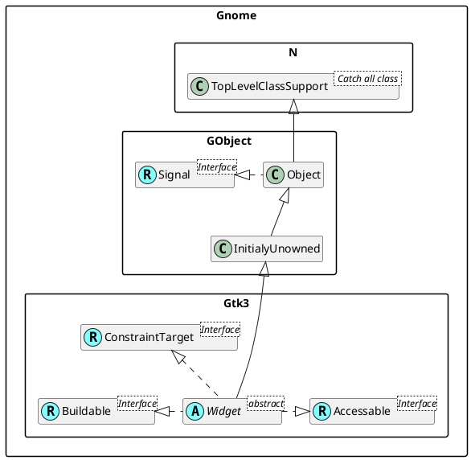

```plantuml
@startuml
'scale 0.9
skinparam packageStyle rectangle
skinparam stereotypeCBackgroundColor #80ffff
set namespaceSeparator ::
hide members

'Class definitions
class Gnome::N::TopLevelClassSupport < Catch all class >
Gnome::N::TopLevelClassSupport <|-- Gnome::GObject::Object

Interface Gnome::GObject::Signal <Interface>
class Gnome::GObject::Signal <<(R,#80ffff)>>

Interface Gnome::Gtk3::Buildable <Interface>
class Gnome::Gtk3::Buildable <<(R,#80ffff)>>

Interface Gnome::Gtk3::Accessable <Interface>
class Gnome::Gtk3::Accessable <<(R,#80ffff)>>

Interface Gnome::Gtk3::ConstraintTarget <Interface>
class Gnome::Gtk3::ConstraintTarget <<(R,#80ffff)>>

abstract Gnome::Gtk3::Widget <abstract> <<(A,#80ffff)>>


'Class relations
Gnome::GObject::Object <|-- Gnome::GObject::InitialyUnowned
Gnome::GObject::Signal <|. Gnome::GObject::Object

Gnome::GObject::InitialyUnowned <|--- Gnome::Gtk3::Widget
Gnome::Gtk3::Buildable <|. Gnome::Gtk3::Widget
Gnome::Gtk3::Accessable <|.left. Gnome::Gtk3::Widget
Gnome::Gtk3::ConstraintTarget <|.. Gnome::Gtk3::Widget
@enduml
```
